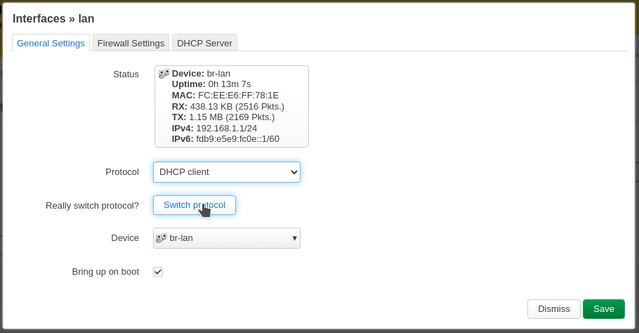
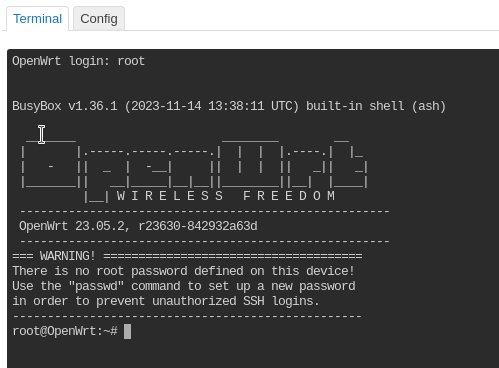

# OctoWrt

<p align="left">

</p>

A guide to installing OctoPrint on the Creality WiFi Box or similar OpenWrt devices.

------------------

#### What is the Creality [Wi-Fi Box](https://www.creality.com/goods-detail/creality-box-3d-printer)?

<details>
  <summary>Click to expand info!</summary>


A router box device released by Creality meant to add cloud control to your printer. Comes with closed source and proprietary software. However, some people might not like that.

**Specifications:**

 (_taken from figgyc's commit_)

- **SoC**: MediaTek MT7688AN @ 580 MHz
- **Flash**: BoyaMicro BY25Q128AS (16 MiB, SPI NOR)
- **RAM**: 128 MiB DDR2 (Winbond W971GG6SB-25)
- **Wireless**: MediaTek MT7628 802.11b/g/n
- **Peripheral**: Genesys Logic GL850G 2 port USB 2.0 hub
- **I/O**: 1x 10/100 Ethernet port, microSD SD-XC Class 10 slot, 4x LEDs, 2x USB 2.0 ports, micro USB input (for power only), reset button
- **FCC ID**: 2AXH6CREALITY-BOX
- **UART**: test pads: (square on silkscreen) 3V3, TX, RX, GND; default baudrate: 57600  
  
  </details>
  

#### Demo:
<details>
  <summary>Click to expand demo video!</summary>

https://user-images.githubusercontent.com/40600040/128418449-79f69b98-8f81-4315-b18a-8869d186eed6.mp4

</details>

------------------

## Hardware Setup:

There are some decisions you will have to make about how the box will be deployed but the way to set it up for an Octoprint installation is via a network cable connected to your main router. You will also need a microSD card, to expand the storage of the device, permanently inserted.

<details>

  <summary>Click to expand Firmware Installation</summary>

  ## ⚠️ [Click Here For Firmware](https://github.com/shivajiva101/OctoWrt/releases/tag/5.15.137-r2) ⚠️

## Flashing OpenWrt:  

### If you're box is currently on stock firmware:

Alternative Options:  
**A. Standard option**

1. Copy `cxsw_update.tar.bz2` from this release to the root of a FAT32 formatted microSD card.  
2. Turn on the device, wait for it to start, then insert the card. The stock firmware reads the `install.sh` script from this archive and flashes the new OpenWrt image.  
3. The box will create a wireless AP `OpenWrt`, you can now proceed to install setup

**B. Through the Stock firmware UI interface (link)**

**C. Using the `Recovery process`** see below  

### If your box is already on OpenWrt and has the luci web UI reachable:

Alternative Options:  
**A. Flashing another Openwrt binary:** Access the luci web UI -> Go to System -> Upgrade -> Uncheck the box that sais `Save configs` -> Upload the SYSUPGRADE bin -> Flash  
**B. Resetting the box** By holding the reset button for about 6 seconds the box will freshly reset the current OpenWrt firmware.  
**C. Using the `Recovery process`** see below  


## Recovery process  
If the box is either on stock or Openwrt but unreachable (semi bricked) 
⚠️ With the recovery process you can restore stock firmware or install/recover Openwrt firmware regardless of what's already on the box.

**Recovering to Openwrt**  
1. Rename the SYSUPGRADE bin to `root_uImage`  
2. Put it on a fat32 formatted USB stick (not uSD card)  
3. With the box powerd off, plug the USB stick in the box  
4. Press and hold the reset button.  
5. While holding the reset button power on the box and keep it pressed for about 6-10sec  
6. Leds should start flashing while the box installs the firmware  
7. Let it be for a couple of minutes until you see it on the network (`OctoWrt` WiFi AP )  

**Restoring to Stock**  
1. Extract the `root_uImage` file from the `cxsw_update.tar.bz2`   
2 - 6. Same steps as above  
7. You should see the creality AP


</details>

<p></p>
<details>
  <summary>Click to expand Install setup</summary>

#### Connect to the wireless access point:

<p align="left">

</p>

#### Login to Luci from a browser:

Using a web browser enter `192.168.1.1:81` in the address bar, it will automatically redirect to the Luci login page. Credentials are root for the username and the password field left blank.

<p align="left">

</p>

#### Select Network->Interfaces :

Access the lan interface from the dropdown menu.

<p align="left">

</p>

#### Edit the lan interface:

Select edit to access the settings.

<p align="left">

</p>

#### Change Protocol:

Change the lan interface from Static address to DHCP client.

<p align="left">

</p>

#### Confirm Protocol switch:

Confirm by clicking the Switch Protocol button and then save.
<p align="left">

</p>

#### Save & Apply unchecked:
<p align="left">

</p>

#### ⚠️ Now disconnect from the wireless AP and connect via an ethernet cable to your main router or a hub connected to the main router!

#### DHCP Client IP address:
Check the main routers interface for the IP address it assigned the box and use it to access the Luci interface e.g. `192.168.0.100:81`
<p align="left">

</p>

Login using root, leaving the password field blank, then access Services->Terminal and login as root.

<p align="left">

</p>

<details>

<summary>Terminal config</summary>
<p></p>
If the terminal cannot connect you need to change the interface for the terminal in the config tab
<p></p>
<p align="left">

</p>

#### Select interface:
<p align="left">

</p>

#### Save & Apply:
<p align="left">

</p>
</details>

#### Connect:
<p align="left">

</p>

#### You are now ready to proceed with step 1 of the Automatic or Manual Installation!

</details>
<p></p>
 <details>

  <summary>Click to expand Wireless AP post install setup</summary>

  ## Wireless Access Point

  If you plan to use the wireless AP for accessing OctoPrint & the Luci Admin interface post OctoPrint installation, rather than a network cable, you will need to change the lan interface back to a static IP for it to function correctly. This is due to the AP connectivity requiring the LAN interface to have: 
  - a different subnet to the main router so the gateways are different.
  - a DHCP server to assign IP addresses to that subnet.

#### Access Network->Wireless
<p align="left">

</p>

#### Scan for main router AP:
<p align="left">

</p>

#### Scan in progress:
<p align="left">

</p>

#### Selecting the main routers AP:
<p align="left">

</p>

#### Connection details:
Enter the main routers wifi password and lock the BSSID then save.
<p align="left">

</p>

#### Save & Apply:
<p></p>
<p align="left">

</p>

#### Wifi connection to main router:
<p align="left">

</p>

#### Access Network->Interfaces
Now it is safe to return the lan interface to static IP with DHCP server.
<p align="left">

</p>

#### Edit lan interface:
<p align="left">

</p>


#### Change protocol to static:
<p align="left">

</p>

#### Confirm switch:
<p align="left">

</p>

#### Choose wireless access point IP address:
If `192.168.1.1` is already in use by the main router, to avoid conflicts, change it to an available subnet e.g. `192.168.3.1` and set the netmask before saving.
<p align="left">

</p>

#### Save, then Apply unchecked:
<p align="left">

</p>

#### Disconnect the LAN cable and power cycle:
When the box boots you can connect to the wireless AP.
<p align="left">

</p>


#### Check the connection is assigned to the static IP:
<p align="left">

</p>

Congratulations you are all done! You can access OctoPrint through the wireless AP on the default gateway of the connection.
</details>

## Automatic Installation:

<details>
  <summary>Expand steps</summary>
  <p></p>

---
  ### ⚠️ You must complete the firmware and install setup before running these scripts! ⚠️
---
  #### 1. Execute extroot script:
   Make sure you have a microSD card inserted, then copy and paste the commands below...
  ```
  wget https://github.com/shivajiva101/OctoWrt/raw/23.05.2-137/scripts/1_format_extroot.sh
  chmod +x 1_format_extroot.sh
  ./1_format_extroot.sh

  ```
  #### 2. Execute install script:
  <b>Important:</b> You *need* a stable internet connection for this to succeed.
  If the script fails try using the manual installation method.
  ```
  wget https://github.com/shivajiva101/OctoWrt/raw/23.05.2-137/scripts/2_octoprint_install.sh
  chmod +x 2_octoprint_install.sh
  ./2_octoprint_install.sh

  ```


  #### 3. Access Octoprint UI on port 5000

  ```
  http://box-ip:5000
  ```

  When prompted use the following **server commands**:

    - Restart OctoPrint : `/etc/init.d/octoprint restart`
    - Restart system : `reboot`
    - Shutdown system : `poweroff`

  For **webcam** support:

  Services->MJPG-Streamer is the configuration interface. Modify that to change resolution, fps, user, pass etc.

  Inside OctoPrint snapshot and stream fields add the following:
  - Stream URL: `http://your-box-ip:8080/?action=stream`
  - Snapshot URL: `http://your-box-ip:8080/?action=snapshot`
  - ffmpeg binary path as: `/usr/bin/ffmpeg`


</details>

## Manual Installation:

<details>
  <summary>Expand steps</summary>

---
  ### ⚠️ You must complete the firmware and install setup before running these scripts! ⚠️
---

## ⤵️ 1. Prepare:

<details>
  <summary>Expand steps!</summary>
  


 #### 1. Extroot:
  First execute [this](https://github.com/shivajiva101/OctoWrt/blob/23.05.2-137/scripts/1_format_extroot.sh) script. Make sure you have a microsd card inserted as this step creates an extroot filesytem overlay on the card to expand the available space. Here's the code to fetch the script and run it.
  
  ```
  cd ~
  wget https://github.com/shivajiva101/OctoWrt/raw/23.05.2-137/scripts/1_format_extroot.sh
  chmod +x 1_format_extroot.sh
  ./1_format_extroot.sh

  ```
  
#### 2. Swap:
Next step is to create a swapfile on the newly created overlay fs.

  ```
  dd if=/dev/zero of=/overlay/swap.page bs=1M count=512;
  mkswap /overlay/swap.page;
  swapon /overlay/swap.page;
  mount -o remount,size=256M /tmp;

  ```
#### 3. Mount:
Create new rc.local file to mount swap file and tmp folder on boot
  ```
  rm /etc/rc.local;
  cat << "EOF" > /etc/rc.local
  # Put your custom commands here that should be executed once
  # the system init finished. By default this file does nothing.
  ### activate the swap file on the SD card
  swapon /overlay/swap.page
  ### expand /tmp space
  mount -o remount,size=256M /tmp
  exit 0
  EOF

  ```
  
</details>

## ⤵️ 2. Install:

<details>
  <summary>Expand steps!</summary>
  <p></p>
Now you can setup the correct package feeds. OpenWrt doesn't include WB01 hardware currently so there is a mismatch in the kernel version when using their repository for the core packages. Instead you are going to use the core packages created when this releases firmware was compiled and subsequently uploaded to this branch. This ensures all kernel modules match the kernel signature and can be installed through opkg, making it more extensible to other 3D printers.

#### 1. Install OpenWrt dependencies:

Update the package feeds.
```
rm /etc/opkg/distfeeds.conf;
wget https://github.com/shivajiva101/OctoWrt/raw/23.05.2-137/openwrt/distfeeds.conf -P /etc/opkg
```
---
Next step is to update opkg from the new distfeeds.conf and install the dependencies.
```
opkg update
opkg install gcc make unzip htop wget-ssl git-http kmod-video-uvc luci-app-mjpg-streamer
opkg install v4l-utils mjpg-streamer-input-uvc mjpg-streamer-output-http mjpg-streamer-www ffmpeg

```
------------------------------

Install python 3 packages.
```
opkg install python3 python3-pip python3-dev python3-psutil python3-yaml python3-netifaces
opkg install python3-pillow python3-tornado python3-markupsafe
pip install --upgrade setuptools
pip install --upgrade pip
pip install future regex sgmllib3k

```
 
--------------------

#### 2. Fetch Octoprint:
Next step is cloning OctoPrint and then patching it to remove the argon2-cffi dependency that OpenWrt cannot fulfil.
```
git clone --depth 1 -b 1.9.3 https://github.com/OctoPrint/OctoPrint.git src
cd src
wget https://github.com/shivajiva101/OctoWrt/raw/23.05.2-137/octoprint/noargon2.patch
git apply noargon2.patch

```
#### 3. Install OctoPrint:
If you are running this step again due to a failed previous attempt it's essential that the current directory is ~/src before executing the command!
```
pip install .

```

#### 4. Create octoprint service:
  
  <details>
    <summary> Expand </summary>
  
  ```
  cat << "EOF" > /etc/init.d/octoprint
  #!/bin/sh /etc/rc.common
  # Copyright (C) 2009-2014 OpenWrt.org
  # Put this inside /etc/init.d/

  START=91
  STOP=10
  USE_PROCD=1


  start_service() {
      procd_open_instance
      procd_set_param command octoprint serve --iknowwhatimdoing
      procd_set_param respawn
      procd_set_param stdout 1
      procd_set_param stderr 1
      procd_close_instance
  }
  EOF

  ```
  </details>
  
#### 5. Make it executable:

```
chmod +x /etc/init.d/octoprint

```
#### 6. Enable the service:

```
service octoprint enable

``` 

#### 7. Reboot and wait a while

```
reboot

```

▶️ _**Note!**_  
_Booting the latest versions of OctoPrint takes a while (~5 minutes) and even longer on the first boot after installation when OctoPrint will configure itself. Once booted however, everything works as expected. If you care that much about this you can install older versions (v1.0.0 for example) that are much lighter but are not plugin enabled. Only Temps, Control, Webcam and Gcode preview._
  
#### 8. First setup
  
<details>
  <summary> Expand steps </summary>
  
Access Octoprint UI on port 5000
  
```
http://box-ip:5000
```
  
When prompted use thefollowing **server commands**:

  - Restart OctoPrint : `/etc/init.d/octoprint restart`  
  - Restart system : `reboot`  
  - Shutdown system : `poweroff`  

For **webcam** support:  
  
  `/etc/config/mjpg-streamer` is the configuration file. Modify that to change resolution, fps, user, pass etc.  
  Inside OctoPrint snapshot and stream fields add the following:
  - Stream URL: `http://your-box-ip:8080/?action=stream`  
  - Snapshot URL: `http://your-box-ip:8080/?action=snapshot` 
  
  If webcam not showing, unplug and replug it.  
    
  </details>
  
  #### 9. Timelapse plugin setup

* _ffmpeg bin path_
  
  <details>
    <summary> Expand steps </summary>
    
    In octoprint settings set the ffmpeg binary path as:
    
    ```
    /usr/bin/ffmpeg
    ```
    
   </details
  
</details>

</details>

## 🔝 Credits:

  **Gina and co.** for creating and developing [OctoPrint](https://github.com/OctoPrint/OctoPrint)  
  **George** a.k.a [figgyc](https://github.com/figgyc) for porting OpenWrt to this device  
  **ihrapsa** for creating and developing [OctoWrt](https://github.com/ihrapsa/OctoWrt) without their effort this fork would not exist!
